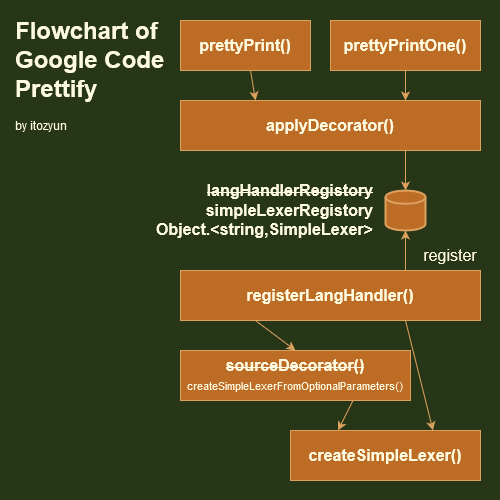
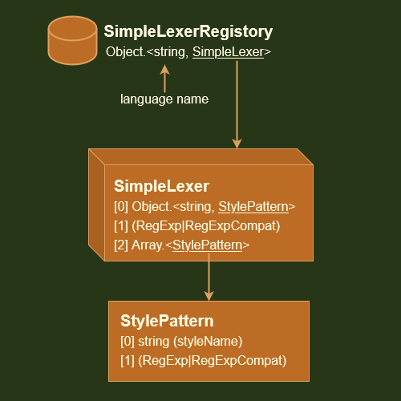

# Code Prettify for ES2



[Edit in draw.io](https://viewer.diagrams.net/?tags=%7B%7D&highlight=0000ff&edit=_blank&layers=1&nav=1&title=FllowchartOfGoogleCodePrettify.drawio.png#R7Vtbd%2BI2EP41nNM%2BJAfJQMhjAmTzsD1Jm%2B5p96lH2IqtxpZcWQTYX1%2FJlnyRTXBYDGSXl8Qa3az5vhmNRqbnTKLVJ47i4Dfm4bAH%2B96q50x7EI5BX%2F5VgnUmuLrWAp8TLxOBQvBEvmEtNM0WxMNJpaFgLBQkrgpdRil2RUWGOGfLarNnFlZnjZGPa4InF4V16V%2FEE0EmHfb7hfweEz8QVsUcuS8%2BZwuqp%2BtBB46dERhn1REyQ%2Bn2SYA8tiyJnFnPmXDGRPYUrSY4VJo1Wsv63W2ozV%2BbYyradJhOyb2YRfTLxe9x9I8%2FpvTb3YUe5RWFC2yWkb6sWBv9pEvEapB%2Bz7ldBkTgpxi5qnYpCSFlgYhCWQLy8ZmE4YSFjKd9ndvJaAKHUp4Izl5wqWY6vQHDmerBqCjJ72Z3NzM1kX4xzAVebVwxyPUo2YlZhAVfyyamw1irXjPTILEsYAaOlgUViDW7NLP8fORCvfJBa%2Fgd2nZ%2BZG07znZtDw%2Bp7UFN2zHHQqwfOaHigeJffq1pX65eVFVcVSVlFFt61yIUEp%2FKoiu1haX8VumSSC9zoysi4nlqmkZMq6grkLSfBCNT1i8JOgZxUAXRaWkyTlcgjt4C8Yzgdqd3dASH%2B3Z6tm5PyQna2gf9uvqd%2FiG9IKypH8VxuJ5il3EkGD%2FbUAsUQUsUOzOi8XYjwtS7UeGwUn%2BIkoS4VQzf1i5eEfG3qrsc6tJX3U89T1e6W1pYmwKVS8s6XQ1N%2BWu5suiXlkzHEM1xeJvHzyUUdQS9u%2FVirxbtW6hLpbEFd%2FH2OE0g7mOxzbXVWbQsHyM2mzrHIRLktfq6TczRMzwyueWVtmpgxVs2%2BbJl6l7lg4E90Mhi%2B9gaKNNDbaCUyPmyd%2Bf2Vdfc7oRuJfLDd5G%2FPU9Pm3%2F5OObcvyP97HEAPCz9jBn9nAFKDtvRAhRQz0Fw7JNEBhCfEfXvEZURwzlMaYPl%2BNhhCqhHm99pS6dsO86wrm940IQSaMoojUKRaYi8YFny01LqjCtBf9ZMTlttaSrm3JYozSooTQZ39N9C5S5vQfFod0liRCvom4ZqrIulVtGNbEIZj5Bab9q7n9ZnM6laAOJVfRaXYyTJQ6I4xJ%2FxCvM7zqKHWBBGUfiIOJJKxjypLjZ9o%2BpbSnG2NiM%2BO5otxB%2B1JH53jqae3PuBHA28rup70JTEuT6oo6lncWrWd96iWyA5aIlkd5Zzvd1yMpDMbRi0EAxQrNpFK1%2FdB14%2Bh2zpBoiLSw8JNEfJJlBOOi52xsMKUDkoJaAGDTgNusIJNh1Lmrb2sAiS%2F0jjZqZm37SJ1%2Fb7pDDgN7o%2FzP%2FFrriURRQpLPP3oH4PTkpOIG%2FR1VbKM91%2FUH8AoE2zYX0nbTq0d%2BYPjPk3HL8%2BkDvvCK4BtE5YDe57dFC0Wlwh7ysRfLVTJvhdubC09Ig5SSP13sfIDmuL3Zqdy3baY6XngJ0etmPDtvk5YKWHYd8aaEN%2BTnIQrUvNYtUgqVnAHjJ4cK8Z5NStvWDhBiULaaLUGyTcENm4C%2F6aG94GQ%2BvvZGhgF0Pbo00Ysp24UdjheH6H8u47E%2Bs7iXwXOFDSGu71QvBglN91m8hNBbbfk47CbnhUdlue2tn5RvDY7G5xRj1Bdn9n5PS%2BO%2FSj0Htwdt57oLcxy5%2BL3l3dkm%2BnNzzT%2B6D0bvqoPEsoBcAklO5M1lA2ZM%2F1hNMnxnxpC7A%2FYZ7696i%2B%2BiTPb2e2iuGNMDaCuQKSCPZtvaClHnEHlz5JjFyVF3Omw6L0J4ul4AJuuopgr5irTKqUBMTzMK0d1FvZeG8PKSr7C8aenfEATSmPXTKhslj8%2FiGjX%2FETE2f2Pw%3D%3D)




[Edit in draw.io](https://viewer.diagrams.net/?tags=%7B%7D&highlight=0000ff&edit=_blank&layers=1&nav=1&title=SimpleLexerRegistory.drawio#R7Vlbd6M2EP41nLN9WB8EBjuPvqXtadqkzUO7fZNBwdoAYoXwpb9%2BJSQBAhw7ju2kPX2yNBqNpJlP34yw5c6S7Y8UZqtfSYhiy7HDreXOLccBtuPzHyHZScnoxpaCiOJQKdWCR%2FwP0jOVtMAhyg1FRkjMcGYKA5KmKGCGDFJKNqbaE4nNVTMYoY7gMYBxV%2FonDtlKSj3bruU%2FIRytWGtgCYPniJIiVctZjuuMXR%2BM5XACtSmln69gSDYNkbuw3BklhMlWsp2hWLhWe03Ou90zWm2bopQdM2EH0d%2B%2F79jt3c%2BLrxR%2Fw3Tyy%2FqzsrKGcYH0McrNsp32D993JprBLsZpiKhrudPNCjP0mMFADGw4LrhsxZKY9wBvLoVXUHi3rASVr%2B4Lxs0gJc8lGoAn2oyS5yoE3D3TJxzHMxITWm7Enc78mVNrNkbm8wnwFmIGSVlDfru4nSxsLlenRJSh7V73gSooHOuIJIjRHVdRE3wVRoVyHdVNDRmtsWqgRcugAmlU2a0jxRsqWK8InNMJ3CNOshjdoS2if6AI54yIZfyYCf9T3opY6QkpEZ4ScdbX0f9WCCBOQd1sT8kzmBrQ0IrC1ueNOvWEq6SEJlAcoZxtl%2BNyJTEK%2FGzbXeV%2B%2BZXf7gHvwkTASS7JKE4jy5kJW2obhZ7ROLAe464sGtuWloxDcA15Dr8tlh7R4tYl4LhhJsZNEKZEYNpArBLBGEepuD4cZ3yj7lSgEHP6maiBBIehWKb3UlF5k7jAVo5WBOpUfbVJcFn4j034gy78XdCD%2F%2FGl8O%2B%2BgriK5T73nsJZIaTP99wMZsIX9sD2TKFTSkEnePkzYsGqEcm%2BSL1AbXvI8AyxBaAV3LHXiW4VyWZ0wfBS4R32hFfe1BCv25d3%2BTIjLDv6HTbkWj12e0SaNvs58BDHWd7Utjw%2Byz6B7cSSD5BxEklfRXcmr137vECe9xNPSYttZo1msjEjSQbZDx9mm47c5oRSuGtF5bqROHveidETe1vWOYq42qnpHLQ0bJdcwy4tDftoST9Jzk5L3uGsg9JwIl4lIvHEMM9xYMav9i3o863yIfDPmiSCgq7reHYKbR4QuvtLDZedL83OXAREJAXd3zVHHxDF3LuitpnXkUdh59XVijt%2F5kEaIXYoyXfxsWk%2B07rh1zKKYsjw2txGHyTUCg8Elyyi4OfceAb8Rp5pIScFDZCa1Hx3te24ph0AWoakGzqGSoBWpz4ds%2F5hzJr3%2FUChdCXInoNAWp53Rz11TR%2BCgH2pumb0cl1ja9auk1TJ352U1ZeD%2FgWPvLoA0rWO%2Falc6jeYoGY1cNQb7WCRcLQ7P7LDjqugemva%2F71orlK0Bb1e62i9zZMfsKJ7x%2B8IYDgatFj5poeVHe%2BK3xLG%2F%2FWqblCVbt26ru7pqu6MBZz%2FrgVc65Ot2y68jq3gXLtVwbnXreBuOviMYRoV4n8Nzoc8c16AZM7xufKka3CBh2NVcTdwB9y%2Buu9S70b9ge3DUszxf74YpIO2mDUYhve%2BNEZqfhEd49EoJw1t1yCmwXjkHSCnNz455ZU%2FfNcOMpvzrszW%2FmBrn8hsnZvSNrSH2crvZA21TCjkr%2BM%2B3q3%2F%2FJTq9R%2FM7uI7)

---

## 比較

<table>
<thead>
<tr>
<th><th>Google Code Prettify<th>Code Prettify for ES2
<tbody>
<tr>
<th>サポートするブラウザの下限<td>IE6+, Gecko 1.8+, Opera 8+<td>IE5, Gecko 0.6+, Opera 7.0+
<tr>
<th>言語のサポート<td>ビルトイン以外は動的に追加する<td>ビルド時にサイトやページで使用する言語を選択する
<tr>
<th>言語拡張とテーマの動的追加<td>✔<td>✖
<tr>
<th>ファイルサイズ<td>KB<td>KB (基本的サポートと同等になる `web,c...` でビルドした場合 )
<tr>
<th>行番号<td>✔<td>✔ ビルド時に機能を無効に出来ます
<tr>
<th>コメントノードで指定<td>✔<td>✔ ビルド時に機能を無効に出来ます。コメントノードに非対応のブラウザがあります。
<tr>
<th>時分割で実行<td>マニュアル。<code>.prettify</code> 要素のハイライトを終えるタイミングで経過時間を計測してスケジュールする。<td>常に有効。正規表現インスタンスの生成やトークン作成、デコレーションの其々のタイミングで経過時間を計測してスケジュールする。
</table>

## ビルド


~~~
gulp js
gulp js-web
gulp sd
gulp sd-web
~~~


# JavaScript code prettifier

Announcement: [**Action required** *rawgit.com* is going away](https://groups.google.com/forum/#!topic/js-code-prettifier/IFHev_kLm30).

An embeddable script that makes source-code snippets in HTML prettier.

* Works on HTML pages.
* Works even if code contains embedded links, line numbers, etc.
* Simple API: include some JS & CSS and add an onload handler.
* Lightweights: small download and does not block page from loading while
  running.
* Customizable styles via CSS. See the [themes gallery][1].
* Supports all C-like, Bash-like, and XML-like languages. No need to specify
  the language.
* Extensible language handlers for other languages. You can specify the
  language.
* Widely used with good cross-browser support. Powers https://code.google.com/
  and http://stackoverflow.com/

[See an example][2].

## Setup

 * Include the script tag below in your document:
```HTML
<script src="https://cdn.jsdelivr.net/gh/google/code-prettify@master/loader/run_prettify.js"></script>
```
 * See [Getting Started](docs/getting_started.md) to configure that URL with
   options you need.
 * Look at the [skin gallery][1] and pick styles that suit you.

## Usage

Put code snippets in `<pre class="prettyprint">...</pre>` or
`<code class="prettyprint">...</code>` and it will automatically be
pretty-printed.

```HTML
<pre class="prettyprint">class Voila {
public:
  // Voila
  static const string VOILA = "Voila";

  // will not interfere with embedded <a href="#voila2">tags</a>.
}</pre>
```

## FAQ

### For which languages does it work?

The comments in `prettify.js` are authoritative but the lexer should work on a
number of languages including C and friends, Java, Python, Bash, SQL, HTML,
XML, CSS, JavaScript, Makefile, and Rust.

It works passably on Ruby, PHP, VB, and Awk and a decent subset of Perl and
Ruby, but because of commenting conventions, doesn't work on Smalltalk, OCaml,
etc. without a language extension.

Other languages are supported via extensions:

[Apollo](src/lang-apollo.js);
[Basic](src/lang-basic.js);
[Clojure](src/lang-clj.js);
[CSS](src/lang-css.js);
[Dart](src/lang-dart.js);
[Erlang](src/lang-erlang.js);
[Go](src/lang-go.js);
[Haskell](src/lang-hs.js);
[Lasso](src/lang-lasso.js);
[Lisp, Scheme](src/lang-lisp.js);
[LLVM](src/lang-llvm.js);
[Logtalk](src/lang-logtalk.js);
[Lua](src/lang-lua.js);
[MATLAB](src/lang-matlab.js);
[MLs: F#, Ocaml,SML](src/lang-ml.js);
[Mumps](src/lang-mumps.js);
[Nemerle](src/lang-n.js);
[Pascal](src/lang-pascal.js);
[Protocol buffers](src/lang-proto.js);
[R, S](src/lang-r.js);
[RD](src/lang-rd.js);
[Rust](src/lang-rust.js);
[Scala](src/lang-scala.js);
[SQL](src/lang-sql.js);
[Swift](src/lang-swift.js);
[TCL](src/lang-tcl.js);
[LaTeX](src/lang-tex.js);
[Visual Basic](src/lang-vb.js);
[VHDL](src/lang-vhdl.js);
[Wiki](src/lang-wiki.js);
[XQ](src/lang-xq.js);
[YAML](src/lang-yaml.js)

If you'd like to add an extension for your favorite language, please look at
`src/lang-lisp.js` and submit a pull request.

### How do I specify the language of my code?

You don't need to specify the language since `PR.prettyPrint()` will guess.
You can specify a language by specifying the language extension along with the
`prettyprint` class:

```HTML
<pre class="prettyprint lang-html">
  The lang-* class specifies the language file extensions.
  File extensions supported by default include:
    "bsh", "c", "cc", "cpp", "cs", "csh", "cyc", "cv", "htm", "html", "java",
    "js", "m", "mxml", "perl", "pl", "pm", "py", "rb", "sh", "xhtml", "xml",
    "xsl".
</pre>
```

You may also use the [HTML 5][3] convention of embedding a `<code>` element
inside the `<pre>` and using `language-java` style classes:

```HTML
<pre class="prettyprint"><code class="language-java">...</code></pre>
```

### It doesn't work on "obfuscated code sample"?

Yes. Prettifying obfuscated code is like putting lipstick on a pig &mdash;
i.e. outside the scope of this tool.

### Which browsers does it work with?

It's been tested with IE 6, Firefox 1.5 & 2, and Safari 2.0.4. Look at
[the tests][4] to see if it works in your browser.

### What's changed?

See the [changelog](CHANGES.md).

### Why doesn't Prettyprinting of strings work on WordPress?

Apparently wordpress does "smart quoting" which changes close quotes.  This
causes end quotes to not match up with open quotes.

This breaks prettifying as well as copying and pasting of code samples.  See
[WordPress's help center][5] for info on how to stop smart quoting of code
snippets.

### How do I put line numbers in my code?

You can use the `linenums` class to turn on line numbering.  If your code
doesn't start at line number `1`, you can add a colon and a line number to the
end of that class as in `linenums:52`. For example:

```HTML
<pre class="prettyprint linenums:4"
>// This is line 4.
foo();
bar();
baz();
boo();
far();
faz();
</pre>
```

### How do I prevent a portion of markup from being marked as code?

You can use the `nocode` class to identify a span of markup that is not code:

```HTML
<pre class="prettyprint">
int x = foo();  /* This is a comment  <span class="nocode">This is not code</span>
  Continuation of comment */
int y = bar();
</pre>
```

For a more complete example see the [issue #22 testcase][6].

### I get an error message "a is not a function" or "opt_whenDone is not a function"

If you are calling `prettyPrint` via an event handler, wrap it in a function.
Instead of doing:

```JavaScript
addEventListener('load', PR.prettyPrint, false);
```

wrap it in a closure like:

```JavaScript
addEventListener('load', function(event) { PR.prettyPrint(); }, false);
```

so that the browser does not pass an event object to `PR.prettyPrint`
which will confuse it.

### How can I customize the colors and styles of my code?

Prettify adds `<span>` with `class`es describing the kind of code.  You can
create CSS styles to matches these classes.

See the [theme gallery][1] for examples.

### I can't add classes to my code (because it comes from Markdown, etc.)

Instead of `<pre class="prettyprint ...">` you can use a comment or processing
instructions that survives processing instructions: `<?prettify ...?>` works
as explained in [Getting Started](docs/getting_started.md).

### How can I put line numbers on every line instead of just every fifth line?

Prettify puts lines into an HTML list element so that line numbers aren't
caught by copy/paste, and the line numbering is controlled by CSS in the
default stylesheet, `prettify.css`.

The following should turn line numbering back on for the other lines:

```HTML
<style>
li.L0, li.L1, li.L2, li.L3,
li.L5, li.L6, li.L7, li.L8 {
  list-style-type: decimal !important;
}
</style>
```

## Discussion

Please use the official [support group][7] for discussions, suggestions, and
general feedback.

## License

[Apache License 2.0](COPYING)


[1]: https://raw.githack.com/google/code-prettify/master/styles/index.html
[2]: https://raw.githack.com/google/code-prettify/master/examples/quine.html
[3]: http://dev.w3.org/html5/spec-author-view/the-code-element.html#the-code-element
[4]: https://raw.githack.com/google/code-prettify/master/tests/prettify_test.html
[5]: http://wordpress.org/support/topic/125038
[6]: https://raw.githack.com/google/code-prettify/master/tests/prettify_test.html#issue22
[7]: http://groups.google.com/group/js-code-prettifier
